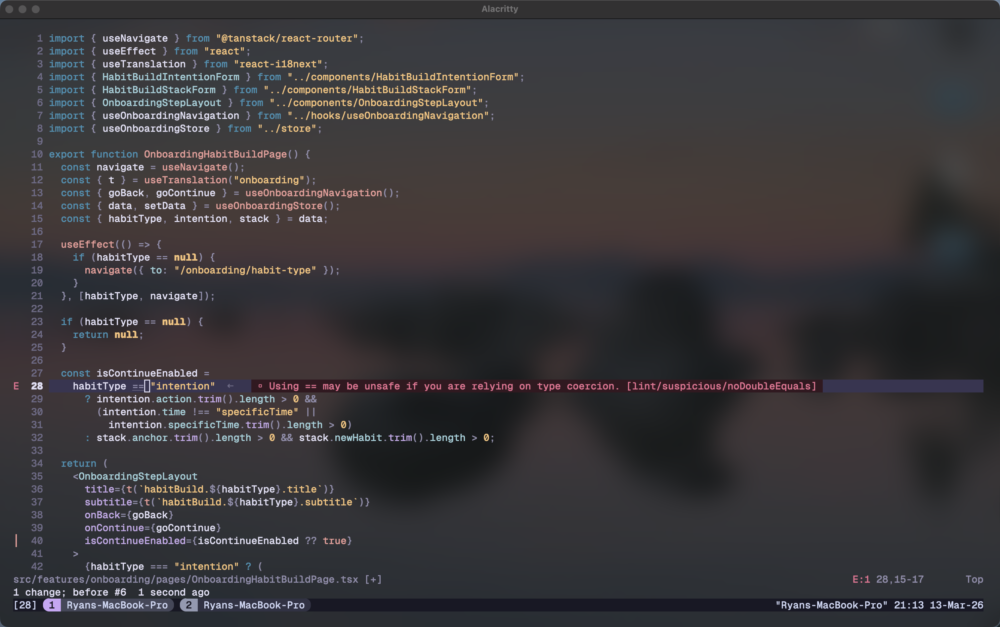

# neovim

- Neovim 0.12+ (Nightly) required
  - Leverages built-in [vim.pack](https://neovim.io/doc/user/pack.html) package manager with [zpack.nvim](https://github.com/zuqini/zpack.nvim)
- ≤ 40ms startup time thanks to lazy-loading
- No distro
- Essentials only, with [Mason](https://github.com/mason-org/mason.nvim) as a convenience
- Stable: uses fixed versions as much as possible
- Collaboration ready ([gh](https://github.com/folke/snacks.nvim/blob/main/docs/gh.md) from [Snacks](https://github.com/folke/snacks.nvim) + [openingh.nvim](https://github.com/Almo7aya/openingh.nvim))
- Compatible with a VS Code environment
- Tailored for TypeScript (I'm a TypeScript SWE)
- AI included (disable `sidekick.nvim` in [`lua/plugins/ai.lua`](./lua/plugins/ai.lua) if you don't want it)

## Prerequisites

- `git`, `gh`, `lazygit`, `ripgrep`, `tmux` (optional)
- Node.js (for LSPs and formatters installed via Mason)
- Rust toolchain (for [blink.cmp](https://github.com/saghen/blink.cmp) build)
- Nerd Font (optional, for icons)
